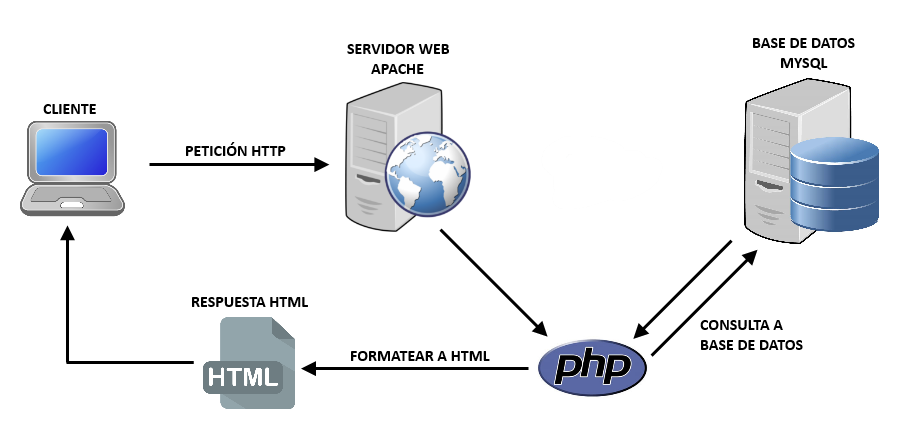
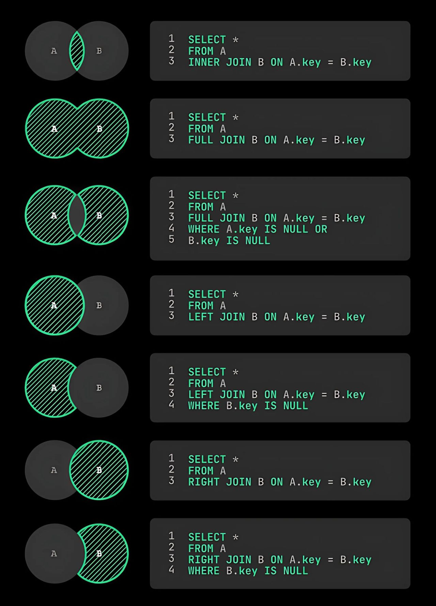
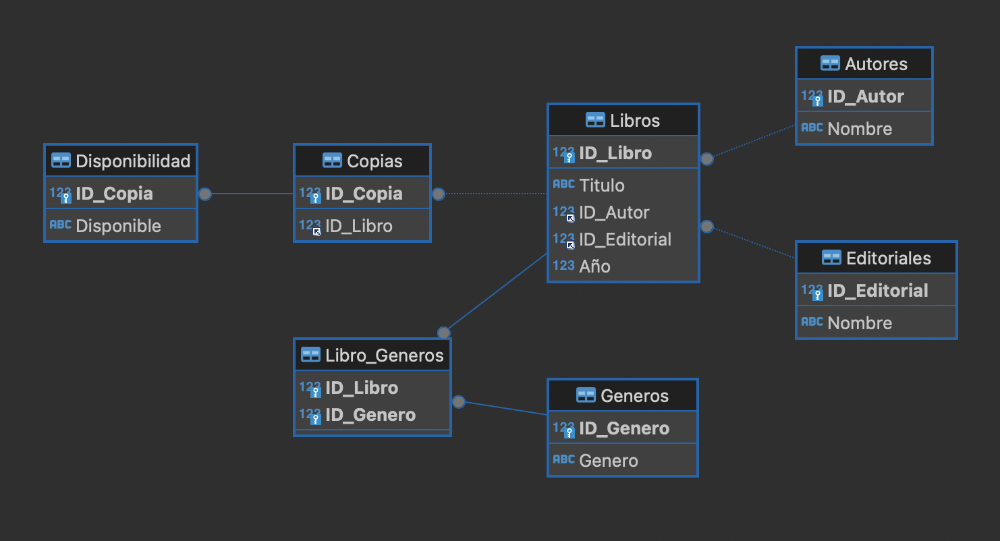

# Hitos de la asignatura

## Lenguajes de programación

Propósito: Armar un CMS (Content Management System) administrable utilizando bases de datos y considerando requisitos del proyecto y `criterios de diseño y
funcionalidad.`

Evaluación final transversal: La evaluación final transversal es un encargo sin presentación que consiste en el desarrollo de un CMS (Content Management System) administrable en el servidor


## Experiencia 1
Comprendiendo los elementos básicos de programación.

| Semana | Actividad | Tipo | Ponderación | Fecha de inicio | Fecha de termino |
|--------|-----------|----------|----------|----------|----------|
| 1      | Formativa 1:Identificando los elementos básicos para trabajar con código. | Individual | 0% | Martes 24 de Diciembre | Lunes 30 de Diciembre |
| 2      | Sumativa 1:Utilizando framework para crear un CMS. | Individual | 👉 20% | Martes 31 de Diciembre | Lunes 06 de enero |

## Experiencia 2
Aplicando PHP para realizar interacciones con la base de datos

| Semana | Actividad | Tipo | Ponderación | Fecha de inicio | Fecha de termino |
|--------|-----------|----------|----------|----------|----------|
| 3     | Formativa 2:Creando una base de datos | Individual | 0% | Martes 07 de Enero | Lunes 13 de Enero |
| 4     | Formativa 3:Realizando consultas SQL para trabajar con bases de datos | Individual | 0% | Martes 14 de enero | Lunes 20 de enero |
| 5     | Sumativa 2:Desplegando el contenido de una base de datos con PHP. | Individual | 👉 40% | Martes 21 de enero | Lunes 27 de enero |


## Experiencia 3
Programando un CMS administrable vía Internet

| Semana | Actividad | Tipo | Ponderación | Fecha de inicio | Fecha de termino |
|--------|-----------|----------|----------|----------|----------|
| 6   | Formativa 4:Aplicando las acciones básicas para gestión de datos. | Individual | 0% | Martes 28 de enero | Lunes 03 de febrero |
| 7   | Formativa 5:Programando acciones en PHP para traspasar información entre páginas. | Individual | 0% | Martes 04 de febrero | Lunes 10 de febrero |
| 8   | Sumativa 3:Utilizando PHP para interactuar con la base de datos y restringir accesos. | Individual | 👉 40% | Martes 11 de Febrero | Lunes 17 de febrero |


## Evaluación Final Transversal
| Semana | Actividad | Tipo | Ponderación | Fecha de inicio | Fecha de termino |
|--------|-----------|----------|----------|----------|----------|
| 9    | Sumativa | Individual | 👉 40% | Jueves 13 de febrero | Domingo 23 de febrero |

# SEMANA 1

PHP (acrónimo recursivo de PHP: Hypertext Preprocessor) es un lenguaje de código abierto muy popular especialmente adecuado para el desarrollo web y que puede ser incrustado en HTML.


# Configuración mínima para trabajar con PHP 

## 1. Instalar un paquete todo-en-uno
La forma más sencilla de trabajar con PHP sin usar la terminal es instalar un paquete que incluya:
- **Servidor web (Apache o Nginx).**
- **PHP.**
- **Base de datos (opcional, como MySQL o MariaDB).**

### Opciones recomendadas:
- **[XAMPP](https://www.apachefriends.org/):**
  - Disponible para Windows, macOS y Linux.
  - Incluye Apache, PHP y MySQL con una interfaz gráfica.
- **[MAMP](https://www.mamp.info/):**
  - Ideal para macOS y Windows, fácil de configurar.
- **[Laragon](https://laragon.org/):**
  - Ligero y rápido, recomendado para Windows.

---

## 2. Configurar el servidor
1. **Instala el paquete elegido (ejemplo: XAMPP).**
2. Abre la interfaz gráfica del servidor.
3. Inicia el servidor Apache (y MySQL si lo necesitas).
4. Coloca tus archivos PHP en la carpeta pública del servidor:
   - En XAMPP: `htdocs` (normalmente en `C:\xampp\htdocs` en Windows o `/Applications/XAMPP/htdocs` en macOS).
   - En MAMP: `htdocs` también.
   - En Laragon: `www`.

---

## 3. Crear y ejecutar tu archivo PHP
1. Crea un archivo PHP en la carpeta pública del servidor. Por ejemplo:
   - `C:\xampp\htdocs\mi_proyecto\index.php`.

2. Escribe el código PHP:
	```php
		<?php
			echo "¡Hola, mundo!";
		?>
	```


## PARA ESCRIBIR PHP
```php

	<?php ?>

```

## USO DE COMENTARIOS
```php

	<?php
		//Comentarios en Line
		/*Comentarios en Bloque*/
	;?>

```

## SALIDA POR PANTALLA PHP
```php

	<?php
		print 'Hola';
		echo  'Hola', 'Hola de nuevo';
	?>

```

## VARIABLES TIPO CADENAS O STRING
```php

	<?php
		$nombre 	= 'Roberto';
		$apellido   = 'Rojas';
		echo "$nombre, $apellido"; // imprime "Roberto, Rojas"

		$4nombre    = 'aun no';   // inválido; comienza con un número
		$_4nombre   = 'aun no';  // válido; comienza con un carácter de subrayado
	?>

```

## VARIABLES TIPO NUMEROS INT
```php

	<?php
		$x = 5985;
		var_dump(is_int($x));//Imprime bool(true)
		echo '</br>';
		$x = 59.85;//Imprime bool(false)
		var_dump(is_int($x));
	?>

```

## VARIABLES TIPO NUMEROS FLOAT
```php

	<?php
		$x = 10.365;
		var_dump(is_float($x));
	?>

```

## ARRAYS
```php

	<?php
		// Array Indexado el orden es a través del indice.
		$cars = array("Volvo", "BMW", "Toyota");
		echo "Me gusta el " . $cars[0] . ", " . $cars[1] . " and " . $cars[2] . ".";
	?>

	<?php
		// Array Asociativo, están ordenados en vase a una llave y el valor asociado a la llave.
		$color = array(

			'pasto' => 'Verde', 
			'cielo' => 'Celeste', 
			'mar' => 'Azul'
			
		);
		echo 'El color que indicaremos será el siguiente:'.$color['pasto'];
	?>


	<?php
		// Array Multidimencional Arreglos dentro de un Arreglo
		$frutas array(
		
			array('Manzana','rojo','12'),
			array('Naranja','naranjo','10'),
			array('Pera','verde','18')

			echo $frutas[0][0].' Su color es:'.$frutas[0][1].' y quedan disponibles '.$frutas[0][1];
		)
	?>


```

## OPERADORES DE COMPARACIÓN
~~~html
==	Igual			$x == $y 
===	Identico		$x === $y 
!=	Distinto		$x != $y
<>	Distinto  		$x <> $y
!==	No es identico	$x !== $y
>	Mayor que		$x > $y
<	Menor que		$x < $y
>=	Mayor igual		$x >= $y
<=	Menor Igual 	$x <= $y
~~~

## OPERADORES DE INCREMENTO Y DECREMENTO
~~~html
++$x	Pre-incrementa
$x++	Post-incrementa
--$x	Pre-decrementa
$x--	Post-decrementa
~~~

## CONCATENAR VARIABLES
```php

	<?php 
		$numeroUno = 18;
		$numeroDos = ' de Septiembre'
		echo '<h1>'.$numeroUno.$numeroDos.'</h1>';
	?>

```

## ESTRUCTURA DE CONTROL

### Condicional IF
```php

	<?php
		$a = 100;
		$b = 0;
		if($a > $b){
		echo "a es mayor que b";
		}
	?>

```

### Condicional anidado con operadores de comparación y operador lógico
```php

	<?php
		$edad = 25;
		$ingresos = 3000;

		// Verificar si la persona es mayor de edad y tiene ingresos suficientes
		if ($edad >= 18 && $ingresos >= 2500) {
			echo "Eres mayor de edad y tienes ingresos suficientes.";
		} elseif ($edad < 18) {
			echo "Eres menor de edad.";
		} else {
			echo "No tienes ingresos suficientes.";
		}
	?>

	<?php
		$hora = 22; // Hora actual en formato de 24 horas
		$díaFestivo = true; // Si es día festivo

		// Verificar si es tarde o si es día festivo
		if ($hora >= 21 || $díaFestivo) {
			echo "Puedes quedarte despierto hasta tarde.";
		} else {
			echo "Es hora de dormir temprano.";
		}
	?>

```


### Funciones

Una función en PHP es un bloque de código que se puede reutilizar para realizar una tarea específica. Las funciones son útiles para evitar la repetición de código, organizar mejor tu programa y hacerlo más modular.

### Definición de una función
En PHP, una función se define con la palabra clave function, seguida del nombre de la función, paréntesis (que pueden contener parámetros) y un bloque de código encerrado en llaves {}.

```php
	function nombreFuncion($parametro1, $parametro2) {
		// Código que realiza la función
		return $resultado; // Opcional
	}
```

### Ejemplo básico: Función para sumar dos números

```php

	<?php
		// Definir la función
		function sumar($numero1, $numero2) {
			$resultado = $numero1 + $numero2;
			return $resultado; // Devuelve el resultado de la suma
		}

		// Llamar a la función
		$suma = sumar(5, 10);
		echo "La suma es: " . $suma; // Salida: La suma es: 15
	?>

```

### Ejemplo avanzado: Función con valor por defecto

```php
	<?php
	function saludar($nombre = "Invitado") {
		return "Hola, " . $nombre . "!";
	}

	// Llamar a la función con un argumento
	echo saludar("Carlos"); // Salida: Hola, Carlos!

	// Llamar a la función sin argumentos
	echo saludar(); // Salida: Hola, Invitado!
?>


```

### Ejemplo: Función sin parámetros

```php

	<?php
		function mostrarFechaActual() {
			echo "La fecha actual es: " . date("Y-m-d");
		}

		// Llamar a la función
		mostrarFechaActual(); // Salida: La fecha actual es: 2024-12-24
	?>

```


### Bucle o Loop While
```php

	<?php
		$a = 0;
		while($a <= 10){
		$a++;
		echo '<h1>'.$a.'</h1>';
		}
	?>

```

### Bucle o Loop Do While
```php

	<?php
		// Se ejecuta primero.
		$a = 1;
		do{
			echo 'El número es:'.$a.'<br>';
			$a++
		// Luego evalúa.
		}while($a <= 10);
	?>

```

### Bucle o Loop For
```php

	<?php  
		for ($x = 0; $x <= 10; $x++) {
		echo 'El número es:'.$x.'<br>';
		}
	?> 

```

### Bucle o Loop Foreach
```php

	<?php 
		//Recorre un array
		$frutas = array('Manzana','Pera','Naranja','Frutilla'); 
		foreach ($frutas as $valor) {
		echo "La fruta es:'.$frutas.'<br>';
		}
	?> 

```

# Experiencia de Aprendizaje 1: Comprendiendo los elementos básicos de programación.

## Semana 1
### Ejercicio formativo 1 : Clase sincrónica sistema de calificaciones 

Crea un programa en PHP que evalúe las calificaciones de un grupo de estudiantes y determine:

-	Si cada estudiante aprobó o reprobó.
-	El promedio general del grupo.
-	Los nombres de los estudiantes que aprobaron.

### Requisitos
1.	Define un array con los nombres de los estudiantes y sus respectivas calificaciones.
2.	Usa una función para determinar si un estudiante aprueba (nota mayor o igual a 60).
3.	Usa estructuras de control if para verificar las condiciones.
4.	Calcula el promedio del grupo.
5.	Muestra los resultados.

### Solución ejercicio
[Actividad Formativa 01](https://github.com/abecerraguz/lenguajes-de-programacion-001A/tree/main/actividades-formativas/semana-01)

## Semana 2
### Actividad Sumativa 1: Preparando las plantillas para un CMS

[Actividad Sumativa 01](https://github.com/abecerraguz/lenguajes-de-programacion-001A/tree/main/actividades-sumativas/semana-02/proyecto-cms)

### Cierre de Experiencia 1
[Video Cierre, Experiencia de Aprendizaje 1: Comprendiendo los elementos básicos de programación.](https://drive.google.com/file/d/1XrqAl59D_n8J55hMyOGG-1fXv_E245LG/view?usp=sharing)


# Experiencia de Aprendizaje 2: Aplicando PHP para realizar interacciones con la base de datos.
## Semana 3


# ¿Qué es MySQL?

MySQL es un **sistema de gestión de bases de datos relacional** (RDBMS, por sus siglas en inglés) que utiliza **SQL** (Structured Query Language) como lenguaje principal para gestionar y manipular datos. Es uno de los sistemas de bases de datos más populares del mundo, conocido por ser **rápido, confiable y fácil de usar**.

## Características principales de MySQL:
1. **Base de datos relacional**: Organiza los datos en tablas con filas y columnas, lo que permite establecer relaciones entre los datos.
2. **Código abierto**: Aunque tiene versiones comerciales, MySQL es de código abierto y gratuito, lo que lo hace accesible para desarrolladores y empresas.
3. **Multiplataforma**: Funciona en diversos sistemas operativos como Windows, Linux y macOS.
4. **Escalabilidad**: Puede manejar bases de datos pequeñas para proyectos individuales hasta bases de datos muy grandes utilizadas por grandes empresas.
5. **Compatibilidad**: Es compatible con múltiples lenguajes de programación como PHP, Python, Java, y más.
6. **Soporte para transacciones**: Proporciona soporte para operaciones transaccionales con características como el control de concurrencia y recuperación ante fallos.
7. **Amplio uso en aplicaciones web**: Es una parte fundamental del stack **LAMP** (Linux, Apache, MySQL, PHP/Perl/Python), utilizado para desarrollar aplicaciones web dinámicas.

## Usos comunes de MySQL:
- Almacenar y gestionar datos para sitios web y aplicaciones (por ejemplo, datos de usuarios, publicaciones, comentarios).
- Manejar bases de datos en sistemas empresariales, como sistemas de inventario, facturación o CRM.
- Generar reportes y análisis a partir de grandes volúmenes de datos.


# Tipos de datos en MySQL

En MySQL, los tipos de datos se dividen en tres categorías principales: **numéricos**, **de fecha y hora** y **de cadenas de texto**.

---

## **1. Tipos de datos numéricos**

### **Enteros**
| Tipo        | Tamaño (bytes) | Rango (con signo)                   | Rango (sin signo)                   |
|-------------|----------------|--------------------------------------|--------------------------------------|
| `TINYINT`   | 1              | -128 a 127                          | 0 a 255                              |
| `SMALLINT`  | 2              | -32,768 a 32,767                    | 0 a 65,535                           |
| `MEDIUMINT` | 3              | -8,388,608 a 8,388,607              | 0 a 16,777,215                       |
| `INT` o `INTEGER` | 4        | -2,147,483,648 a 2,147,483,647      | 0 a 4,294,967,295                    |
| `BIGINT`    | 8              | -9,223,372,036,854,775,808 a 9,223,372,036,854,775,807 | 0 a 18,446,744,073,709,551,615 |

### **Decimales y Flotantes**
| Tipo        | Tamaño (bytes) | Descripción                                     |
|-------------|----------------|-------------------------------------------------|
| `DECIMAL` o `NUMERIC` | Variable | Número exacto con precisión definida. Ejemplo: `DECIMAL(10,2)` |
| `FLOAT`     | 4 o 8          | Número de punto flotante de precisión simple.   |
| `DOUBLE` o `REAL` | 8        | Número de punto flotante de doble precisión.    |

---

## **2. Tipos de datos de fecha y hora**
| Tipo         | Formato                | Rango                            | Descripción                             |
|--------------|------------------------|-----------------------------------|-----------------------------------------|
| `DATE`       | `YYYY-MM-DD`           | 1000-01-01 a 9999-12-31          | Fecha sin hora.                         |
| `DATETIME`   | `YYYY-MM-DD HH:MM:SS`  | 1000-01-01 00:00:00 a 9999-12-31 23:59:59 | Fecha y hora combinadas.          |
| `TIMESTAMP`  | `YYYY-MM-DD HH:MM:SS`  | 1970-01-01 00:00:01 UTC a 2038-01-19 03:14:07 UTC | Marca de tiempo basada en Unix. |
| `TIME`       | `HH:MM:SS`             | -838:59:59 a 838:59:59           | Solo tiempo (horas, minutos, segundos). |
| `YEAR`       | `YYYY`                 | 1901 a 2155                      | Año en formato de cuatro dígitos.       |

---

## **3. Tipos de datos de cadenas de texto**

### **Cadenas de longitud fija**
| Tipo        | Tamaño máximo | Descripción                                         |
|-------------|---------------|-----------------------------------------------------|
| `CHAR`      | 0 a 255       | Cadena de longitud fija. Ejemplo: `CHAR(10)` crea una cadena de 10 caracteres. |

### **Cadenas de longitud variable**
| Tipo        | Tamaño máximo      | Descripción                                     |
|-------------|--------------------|-------------------------------------------------|
| `VARCHAR`   | 0 a 65,535 (dependiendo de la fila) | Cadena de longitud variable. Ejemplo: `VARCHAR(255)`. |

### **Tipos de texto**
| Tipo        | Tamaño máximo      | Descripción                                     |
|-------------|--------------------|-------------------------------------------------|
| `TINYTEXT`  | 255 caracteres     | Texto pequeño.                                  |
| `TEXT`      | 65,535 caracteres  | Texto largo.                                    |
| `MEDIUMTEXT`| 16,777,215 caracteres | Texto muy largo.                             |
| `LONGTEXT`  | 4,294,967,295 caracteres | Texto extremadamente largo.              |

### **Tipos binarios**
| Tipo         | Tamaño máximo      | Descripción                                     |
|--------------|--------------------|-------------------------------------------------|
| `BINARY`     | 0 a 255 bytes      | Similar a `CHAR`, pero almacena datos binarios. |
| `VARBINARY`  | 0 a 65,535 bytes   | Similar a `VARCHAR`, pero para datos binarios.  |
| `TINYBLOB`   | 255 bytes          | Pequeño objeto binario.                        |
| `BLOB`       | 65,535 bytes       | Objeto binario largo.                          |
| `MEDIUMBLOB` | 16,777,215 bytes   | Objeto binario muy largo.                      |
| `LONGBLOB`   | 4,294,967,295 bytes| Objeto binario extremadamente largo.           |

---

## **4. Tipos espaciales (GIS)**
| Tipo         | Descripción                                     |
|--------------|-------------------------------------------------|
| `GEOMETRY`   | Representa datos espaciales.                   |
| `POINT`      | Representa un solo punto (X, Y).               |
| `LINESTRING` | Representa una línea compuesta por varios puntos. |
| `POLYGON`    | Representa un polígono.                        |

---

# ¿Qué es una PRIMARY KEY?
- Es un identificador único para cada registro en una tabla.
- No puede contener valores duplicados ni NULL.
- Una tabla puede tener solo una PRIMARY KEY, pero puede estar compuesta por una o más columnas (clave compuesta).

# ¿Qué es una FOREIGN KEY?
- Es una columna (o conjunto de columnas) en una tabla que se utiliza para establecer una relación con la PRIMARY KEY de otra tabla.
- Garantiza la integridad referencial, es decir, los valores en la FOREIGN KEY deben coincidir con los valores de la PRIMARY KEY en la tabla relacionada.

# Ejemplo
Ejemplo:
Supongamos que tenemos una base de datos llamada  mi_tienda
Supongamos que tenemos dos tablas: users y orders.

1. Tabla users: Contiene información de los usuarios.
	-	Tiene una PRIMARY KEY llamada user_id.

2. Tabla orders: Contiene información sobre pedidos.

	-	Tiene una FOREIGN KEY llamada user_id que referencia a la PRIMARY KEY de users.

### Código SQL:

```sql

	-- Crear tabla users
	CREATE TABLE users (
		user_id INT AUTO_INCREMENT PRIMARY KEY, -- PRIMARY KEY
		name VARCHAR(100) NOT NULL,
		email VARCHAR(100) UNIQUE NOT NULL
	);

	-- Crear tabla orders
	CREATE TABLE orders (
		order_id INT AUTO_INCREMENT PRIMARY KEY, -- PRIMARY KEY
		order_date DATE NOT NULL,
		user_id INT, -- FOREIGN KEY
		FOREIGN KEY (user_id) REFERENCES users(user_id)
	);

```

# Explicación del código:
1. En la tabla users:

	-	user_id es la PRIMARY KEY, lo que significa que cada usuario tendrá un identificador único.
	-	AUTO_INCREMENT asegura que los valores de user_id se generen automáticamente de forma incremental.

2. En la tabla orders:

	- order_id es la PRIMARY KEY.
	- user_id es una FOREIGN KEY que apunta a user_id en la tabla users.
	- La relación asegura que solo se puedan insertar valores en orders.user_id que existan en users.user_id.

### Insertar datos:
```sql
	-- Insertar usuarios en la tabla users
	INSERT INTO users (name, email) VALUES 
	('John Doe', 'john@example.com'),
	('Jane Smith', 'jane@example.com');

	-- Insertar pedidos en la tabla orders
	INSERT INTO orders (order_date, user_id) VALUES 
	('2025-01-08', 1), -- user_id 1 pertenece a John Doe
	('2025-01-09', 2); -- user_id 2 pertenece a Jane Smith

```

### Consulta de datos:

```sql
	-- Obtener los pedidos junto con los nombres de los usuarios
	SELECT orders.order_id, orders.order_date, users.name
	FROM orders
	JOIN users ON orders.user_id = users.user_id;

```

### Resultado

| order_id | order_date | name        |
|----------|------------|-------------|
| 1        | 2025-01-08 | John Doe    |
| 2        | 2025-01-09 | Jane Smith  |


# Conclusión:
- La PRIMARY KEY asegura que cada registro en una tabla sea único.
- La FOREIGN KEY crea una relación entre tablas, garantizando que los datos sean consistentes.

## Semana 4: Realizando consultas SQL para trabajar con BBDD
```sql
/*

CRUD
El acrónimo CRUD se refiere a las operaciones básicas utilizadas en la gestión de bases de datos y sistemas de información. Cada letra representa una de las cuatro operaciones principales:

Create (Crear)
Read (Leer)
Update (Actualizar)
Delete (Eliminar)

*/

-- Filtrando información
/*

URL Para practicar
https://www.programiz.com/sql/online-compiler/


Customer (Clientes)
Orders (Pedidos)
Shippings (Envíos)


*/

SELECT * FROM Customers;
SELECT * FROM Customers WHERE first_name="John";
SELECT * FROM Customers WHERE last_name LIKE 'R%';
SELECT * FROM Customers WHERE age > 21;
SELECT * FROM Customers WHERE age < 28;
SELECT * FROM Customers WHERE age != 28;
SELECT * FROM Customers WHERE age >= 28;
SELECT * FROM Customers WHERE age <= 28;
SELECT first_name FROM Customers ORDER BY first_name ASC;
SELECT first_name FROM Customers ORDER BY first_name DESC;

SELECT first_name,last_name
FROM Customers
WHERE country LIKE 'USA'
ORDER BY first_name DESC;


INSERT INTO customers ( customer_id, first_name, last_name, age, country )
VALUES (6, 'Pedro', 'Rojas', '40', 'MX');


UPDATE customers
SET first_name = 'Juan'
WHERE customer_id = 6;

DELETE FROM customers
WHERE customer_id = 6;


SELECT customers.*, orders.*, shippings.*
FROM customers
JOIN orders ON customers.customer_id = orders.customer_id
JOIN shippings ON orders.customer_id = shippings.customer
WHERE status="Pending" OR status="Delivered";

SELECT customers.*, orders.*, shippings.*
FROM customers
JOIN orders ON customers.customer_id = orders.customer_id
JOIN shippings ON orders.customer_id = shippings.customer
WHERE status="Pending" OR status="Delivered";


------------------------------------------------------------------

CREATE DATABASE cms_blog;

-- Crear la tabla de usuarios
CREATE TABLE cms_usuarios (
    u_id INT PRIMARY KEY AUTO_INCREMENT,
    u_nombre VARCHAR(20) NOT NULL,
    u_username VARCHAR(10) UNIQUE NOT NULL,
    u_password VARCHAR(32) NOT NULL
);

-- Crear la tabla de artículos
CREATE TABLE cms_articulos (
    a_id INT PRIMARY KEY AUTO_INCREMENT,
    a_titulo VARCHAR(100) NOT NULL,
    a_autor INT NOT NULL,
    a_fecha DATETIME NOT NULL,
    a_resumen VARCHAR(200) NOT NULL,
    a_texto TEXT NOT NULL,
    FOREIGN KEY (a_autor) REFERENCES cms_usuarios(u_id) ON DELETE CASCADE
);


INSERT INTO cms_usuarios  (u_nombre, u_username, u_password)
VALUES 
    ('Juan Pérez', 'jperez', 'hash1'),
    ('María González', 'mrojas', 'hash2'),
    ('Pedro Ramírez', 'pramirez', 'hash3');

INSERT INTO cms_articulos (a_titulo, a_autor, a_fecha, a_resumen, a_texto)
VALUES 
    ('Título del Artículo 1', 1, '2025-01-18', 'Resumen del Artículo 1', 'Contenido del Artículo 1'),
    ('Título del Artículo 2', 2, '2025-01-19', 'Resumen del Artículo 2', 'Contenido del Artículo 2'),
    ('Título del Artículo 3', 2, '2025-01-20', 'Resumen del Artículo 3', 'Contenido del Artículo 3');


UPDATE cms_articulos
SET 
    a_titulo = 'Nuevo Título del Artículo 1',
    a_resumen = 'Nuevo Resumen del Artículo 1'
WHERE 
    a_id = 1;


DELETE FROM cms_articulos
WHERE a_id = 3;


-- JOIN
SELECT 
    cms_articulos.a_titulo AS Título,
    cms_usuarios.u_nombre AS Autor,
    cms_articulos.a_fecha AS Fecha
FROM 
    cms_articulos
INNER JOIN 
    cms_usuarios
ON 
    cms_articulos.a_autor = cms_usuarios.u_id;

```
# RESUMEN DE JOIN


# Complementario Semana 4 (Sólo los que consideren hacer su propio modelo)
## Ejemplo de Base de Datos de una Biblioteca en Primera Normalización (1NF)
### Normalización
La normalización en SQL es un proceso sistemático de organización de los datos en una base de datos para:

1. Reducir la redundancia de datos: Evitar la repetición innecesaria de información.
2. Mejorar la integridad de los datos: Garantizar que los datos sean consistentes y correctos.
3. Facilitar el mantenimiento y las actualizaciones: Hacer que la base de datos sea más flexible y fácil de gestionar.

El objetivo principal de la normalización es dividir los datos en tablas relacionadas de forma lógica, siguiendo una serie de reglas conocidas como formas normales.

## Conceptos de la Primera Forma Normal (1NF)
La 1NF establece que:
1. Todos los valores de cada columna deben ser atómicos (no se permiten valores repetidos ni listas en una celda).
2. Cada fila debe ser única (se requiere una clave primaria).
3. Los datos deben estar organizados en tablas, sin columnas repetidas.

---

## Ejemplo: Base de Datos de una Biblioteca

### Tabla sin normalizar
| ID | Título               | Autor                   | Géneros                  | Editorial     | Copias | Año |
|----|----------------------|-------------------------|--------------------------|---------------|--------|-----|
| 1  | El Quijote           | Miguel de Cervantes     | Clásico, Novela          | Editorial X   | 3      | 1605 |
| 2  | Cien años de soledad | Gabriel García Márquez  | Novela, Realismo mágico  | Editorial Y   | 2      | 1967 |

### Problemas:
- La columna "Géneros" tiene múltiples valores en una sola celda (Clásico, Novela).
- No hay separación de entidades relacionadas como autor, género o editorial.
- Difícil de mantener y consultar.

---

## Primera Forma Normal (1NF)
Separamos los datos en tablas relacionadas para eliminar valores repetidos y listas.

### Tabla: Libros
| ID_Libro | Título               | ID_Autor | ID_Editorial | Año |
|----------|----------------------|----------|--------------|-----|
| 1        | El Quijote           | 1        | 1            | 1605 |
| 2        | Cien años de soledad | 2        | 2            | 1967 |

---

### Tabla: Autores
| ID_Autor | Nombre                  |
|----------|-------------------------|
| 1        | Miguel de Cervantes     |
| 2        | Gabriel García Márquez  |

---

### Tabla: Editoriales
| ID_Editorial | Nombre        |
|--------------|---------------|
| 1            | Editorial X   |
| 2            | Editorial Y   |

---

### Tabla: Géneros
| ID_Género | Género             |
|-----------|--------------------|
| 1         | Clásico            |
| 2         | Novela             |
| 3         | Realismo mágico    |

---

### Tabla: Libro_Géneros
| ID_Libro | ID_Género |
|----------|-----------|
| 1        | 1         |
| 1        | 2         |
| 2        | 2         |
| 2        | 3         |

---

### Tabla: Copias
| ID_Copia | ID_Libro | Disponible |
|----------|----------|------------|
| 1        | 1        | Sí         |
| 2        | 1        | Sí         |
| 3        | 1        | No         |
| 4        | 2        | Sí         |
| 5        | 2        | Sí         |

---

## Ventajas de la 1NF
1. **Eliminación de redundancia:** Cada dato está almacenado solo una vez.
2. **Facilidad de actualización:** Actualizar información como el nombre de un autor no afecta otras tablas.
3. **Mejor estructura:** Los datos están organizados y son más fáciles de consultar.

---


# Base de Datos de una Biblioteca en Segunda Forma Normal (2NF)

## Revisión de la Primera Forma Normal (1NF)
En la 1NF, los datos se dividieron en tablas relacionadas, eliminando valores no atómicos y redundancias básicas.

Sin embargo, algunas tablas pueden tener dependencias parciales. Por ejemplo:
- En la tabla `Copias`, la columna `Disponible` depende directamente de `ID_Copia`, no de `ID_Libro`.

---

## Cambios para Cumplir con la Segunda Forma Normal (2NF)

### Tabla: Libros (Sin cambios)
| ID_Libro | Título               | ID_Autor | ID_Editorial | Año |
|----------|----------------------|----------|--------------|-----|
| 1        | El Quijote           | 1        | 1            | 1605 |
| 2        | Cien años de soledad | 2        | 2            | 1967 |

---

### Tabla: Autores (Sin cambios)
| ID_Autor | Nombre                  |
|----------|-------------------------|
| 1        | Miguel de Cervantes     |
| 2        | Gabriel García Márquez  |

---

### Tabla: Editoriales (Sin cambios)
| ID_Editorial | Nombre        |
|--------------|---------------|
| 1            | Editorial X   |
| 2            | Editorial Y   |

---

### Tabla: Géneros (Sin cambios)
| ID_Género | Género             |
|-----------|--------------------|
| 1         | Clásico            |
| 2         | Novela             |
| 3         | Realismo mágico    |

---

### Tabla: Libro_Géneros (Sin cambios)
| ID_Libro | ID_Género |
|----------|-----------|
| 1        | 1         |
| 1        | 2         |
| 2        | 2         |
| 2        | 3         |

---

### Tabla: Copias (Modificada)
La columna `Disponible` ahora depende únicamente de `ID_Copia`. Por lo tanto, no hay dependencias parciales en esta tabla.

| ID_Copia | ID_Libro |
|----------|----------|
| 1        | 1        |
| 2        | 1        |
| 3        | 1        |
| 4        | 2        |
| 5        | 2        |

---

### Nueva Tabla: Disponibilidad
Se crea una nueva tabla para almacenar la disponibilidad de las copias, eliminando dependencias parciales.

| ID_Copia | Disponible |
|----------|------------|
| 1        | Sí         |
| 2        | Sí         |
| 3        | No         |
| 4        | Sí         |
| 5        | Sí         |

---

## Ventajas de la Segunda Forma Normal (2NF)
1. **Eliminación de dependencias parciales:** Ahora, cada columna no clave depende completamente de la clave primaria.
2. **Mayor consistencia:** Los datos están mejor organizados, evitando redundancias y errores.
3. **Facilidad de mantenimiento:** Actualizar datos como la disponibilidad de una copia no afecta a otras tablas.

---

# Base de Datos de una Biblioteca en Tercera Forma Normal (3NF)

## Revisión de la Segunda Forma Normal (2NF)
En la 2NF, eliminamos dependencias parciales dividiendo las tablas y organizando los datos. Sin embargo, pueden existir dependencias transitivas. Por ejemplo:
- En la tabla `Libros`, la columna `ID_Editorial` se refiere a una editorial, pero el nombre de la editorial depende de `ID_Editorial`, no directamente de la clave primaria `ID_Libro`.

---

## Cambios para Cumplir con la Tercera Forma Normal (3NF)

### Tabla: Libros (Sin cambios)
| ID_Libro | Título               | ID_Autor | ID_Editorial | Año |
|----------|----------------------|----------|--------------|-----|
| 1        | El Quijote           | 1        | 1            | 1605 |
| 2        | Cien años de soledad | 2        | 2            | 1967 |

---

### Tabla: Autores (Sin cambios)
| ID_Autor | Nombre                  |
|----------|-------------------------|
| 1        | Miguel de Cervantes     |
| 2        | Gabriel García Márquez  |

---

### Tabla: Editoriales (Sin cambios)
| ID_Editorial | Nombre        |
|--------------|---------------|
| 1            | Editorial X   |
| 2            | Editorial Y   |

---

### Tabla: Géneros (Sin cambios)
| ID_Género | Género             |
|-----------|--------------------|
| 1         | Clásico            |
| 2         | Novela             |
| 3         | Realismo mágico    |

---

### Tabla: Libro_Géneros (Sin cambios)
| ID_Libro | ID_Género |
|----------|-----------|
| 1        | 1         |
| 1        | 2         |
| 2        | 2         |
| 2        | 3         |

---

### Tabla: Copias (Sin cambios)
| ID_Copia | ID_Libro |
|----------|----------|
| 1        | 1        |
| 2        | 1        |
| 3        | 1        |
| 4        | 2        |
| 5        | 2        |

---

### Tabla: Disponibilidad (Sin cambios)
| ID_Copia | Disponible |
|----------|------------|
| 1        | Sí         |
| 2        | Sí         |
| 3        | No         |
| 4        | Sí         |
| 5        | Sí         |

---

## Análisis de Dependencias Transitivas
- No hay dependencias transitivas adicionales. Todas las columnas no clave dependen únicamente de las claves primarias en sus respectivas tablas.

---

## Ventajas de la Tercera Forma Normal (3NF)
1. **Eliminación de dependencias transitivas:** Los datos están completamente normalizados.
2. **Eficiencia en consultas:** Se reduce el riesgo de inconsistencias y redundancias.
3. **Facilidad de escalabilidad:** Es más sencillo agregar nuevas entidades o relaciones sin afectar la estructura existente.

---

¡Felicidades! Ahora la base de datos está completamente normalizada en la tercera forma normal. 🎉

## Ejemplo SQL
```sql
		-- Crear la base de datos
		CREATE DATABASE Biblioteca;

		USE Biblioteca;

		-- Crear la tabla de Autores
		CREATE TABLE Autores (
			ID_Autor INT AUTO_INCREMENT PRIMARY KEY,
			Nombre VARCHAR(100) NOT NULL
		);

		-- Insertar datos en la tabla de Autores
		INSERT INTO Autores (Nombre) VALUES 
		('Miguel de Cervantes'),
		('Gabriel García Márquez');

		-- Crear la tabla de Editoriales
		CREATE TABLE Editoriales (
			ID_Editorial INT AUTO_INCREMENT PRIMARY KEY,
			Nombre VARCHAR(100) NOT NULL
		);

		-- Insertar datos en la tabla de Editoriales
		INSERT INTO Editoriales (Nombre) VALUES 
		('Editorial X'),
		('Editorial Y');

		-- Crear la tabla de Géneros
		CREATE TABLE Generos (
			ID_Genero INT AUTO_INCREMENT PRIMARY KEY,
			Genero VARCHAR(50) NOT NULL
		);

		-- Insertar datos en la tabla de Géneros
		INSERT INTO Generos (Genero) VALUES 
		('Clásico'),
		('Novela'),
		('Realismo mágico');

		-- Crear la tabla de Libros
		CREATE TABLE Libros (
			ID_Libro INT AUTO_INCREMENT PRIMARY KEY,
			Titulo VARCHAR(150) NOT NULL,
			ID_Autor INT NOT NULL,
			ID_Editorial INT NOT NULL,
			Año INT NOT NULL,
			FOREIGN KEY (ID_Autor) REFERENCES Autores(ID_Autor),
			FOREIGN KEY (ID_Editorial) REFERENCES Editoriales(ID_Editorial)
		);

		-- Insertar datos en la tabla de Libros
		INSERT INTO Libros (Titulo, ID_Autor, ID_Editorial, Año) VALUES 
		('El Quijote', 1, 1, 1605),
		('Cien años de soledad', 2, 2, 1967);

		-- Crear la tabla de Libro_Géneros
		CREATE TABLE Libro_Generos (
			ID_Libro INT NOT NULL,
			ID_Genero INT NOT NULL,
			PRIMARY KEY (ID_Libro, ID_Genero),
			FOREIGN KEY (ID_Libro) REFERENCES Libros(ID_Libro),
			FOREIGN KEY (ID_Genero) REFERENCES Generos(ID_Genero)
		);

		-- Insertar datos en la tabla de Libro_Géneros
		INSERT INTO Libro_Generos (ID_Libro, ID_Genero) VALUES 
		(1, 1),
		(1, 2),
		(2, 2),
		(2, 3);

		-- Crear la tabla de Copias
		CREATE TABLE Copias (
			ID_Copia INT AUTO_INCREMENT PRIMARY KEY,
			ID_Libro INT NOT NULL,
			FOREIGN KEY (ID_Libro) REFERENCES Libros(ID_Libro)
		);

		-- Insertar datos en la tabla de Copias
		INSERT INTO Copias (ID_Libro) VALUES 
		(1), (1), (1),
		(2), (2);

		-- Crear la tabla de Disponibilidad
		CREATE TABLE Disponibilidad (
			ID_Copia INT PRIMARY KEY,
			Disponible ENUM('Sí', 'No') NOT NULL,
			FOREIGN KEY (ID_Copia) REFERENCES Copias(ID_Copia)
		);

		-- Insertar datos en la tabla de Disponibilidad
		INSERT INTO Disponibilidad (ID_Copia, Disponible) VALUES 
		(1, 'Sí'),
		(2, 'Sí'),
		(3, 'No'),
		(4, 'Sí'),
		(5, 'Sí');

```

Explicación:

1. Claves primarias y foráneas:

	- Cada tabla tiene una clave primaria (PRIMARY KEY) para identificar de forma única cada registro.
	- Las relaciones entre tablas están definidas mediante claves foráneas (FOREIGN KEY).

2. Tablas relacionadas:

	- Libro_Generos es una tabla intermedia para la relación muchos-a-muchos entre Libros y Generos.
	- Disponibilidad se separa de Copias para evitar dependencias transitivas.

3. Datos de ejemplo:

	- Los inserts iniciales incluyen ejemplos basados en los libros, autores, editoriales y géneros proporcionados.




# Semana 5: Desplegando el contenido de una base de datos
## Componentes principales de una clase
1. Propiedades:

- Son las variables que pertenecen a una clase.
- Definen las características o atributos del objeto.

2. Métodos:

- Son las funciones que pertenecen a una clase.
- Definen el comportamiento o las acciones que puede realizar un objeto.

3. Constructor:

- Es un método especial que se ejecuta automáticamente cuando se crea un objeto a partir de una clase.
- Se utiliza comúnmente para inicializar las propiedades del objeto.

4. Visibilidad:

- Determina el nivel de acceso a las propiedades y métodos.
- Los niveles de visibilidad son:
    - public: Accesible desde cualquier lugar.
    - protected: Accesible solo desde la clase y las clases derivadas.
    - private: Accesible solo desde la clase donde se define.

## Ejemplo básico de una clase en PHP


```php

    class Persona {
        // Propiedades
        public $nombre;
        public $edad;

        // Constructor
        public function __construct($nombre, $edad) {
            $this->nombre = $nombre;
            $this->edad = $edad;
        }

        // Método
        public function saludar() {
            return "Hola, mi nombre es " . $this->nombre . " y tengo " . $this->edad . " años.";
        }
    }

    // Crear un objeto de la clase Persona
    $persona = new Persona("Juan", 30);

    // Acceder a un método
    echo $persona->saludar(); // Salida: Hola, mi nombre es Juan y tengo 30 años.

```

# Explicación del ejemplo

1. Definición de la clase:

    - class Persona { ... } define una clase llamada Persona.

2. Propiedades:

    - public $nombre; y public $edad; son las características del objeto.

3. Constructor:

    - __construct($nombre, $edad) inicializa las propiedades del objeto con los valores pasados al crear una nueva instancia.

4. Método:

    - saludar() es un método que devuelve un mensaje personalizado utilizando las propiedades de la clase.

5. Creación del objeto:
```php

    $persona = new Persona("Juan", 30); // crea una instancia de la clase Persona.

```

6. Acceso al método:
```php

    echo $persona->saludar(); // llama al método saludar() del objeto persona.

```

# Metodos para relaizar un include en PHP

| Método               | Uso Principal                                                                 | Ejecución              | Manejo de Errores                 | Diferencias Clave                                                                                                                                  |
|----------------------|------------------------------------------------------------------------------|------------------------|-----------------------------------|--------------------------------------------------------------------------------------------------------------------------------------------------|
| `include`           | Incluir un archivo y continuar si no se encuentra.                           | Se ejecuta siempre.    | Genera un **Warning** si falla.  | Ideal para incluir contenido no crítico. Si el archivo no se encuentra, el script continúa.                                                     |
| `require`           | Incluir un archivo y detener la ejecución si no se encuentra.                | Se ejecuta siempre.    | Genera un **Fatal Error** si falla. | Se usa para incluir contenido crítico, deteniendo la ejecución si el archivo no está disponible.                                                 |
| `include_once`      | Similar a `include`, pero asegura que el archivo solo se incluye una vez.     | Se ejecuta siempre.    | Genera un **Warning** si falla.  | Útil para evitar incluir el mismo archivo repetidamente, como en configuraciones globales.                                                       |
| `require_once`      | Similar a `require`, pero asegura que el archivo solo se incluye una vez.     | Se ejecuta siempre.    | Genera un **Fatal Error** si falla. | Combina las características de `require` y `include_once`. Ideal para incluir bibliotecas críticas solo una vez.                                 |

### Resumen de Usos
1. Usa **`include`** para archivos opcionales o no críticos.
2. Usa **`require`** para archivos esenciales que detendrán el script si no están disponibles.
3. Usa **`include_once`** o **`require_once`** para evitar conflictos al cargar un archivo varias veces en un mismo contexto.

### Ejemplos de uso para cada método de importar archivos en PHP:
```php

	// Archivo a importar: config.php
	// Contenido de config.php
	define('APP_NAME', 'Mi Aplicación');


```
1. include
Incluye el archivo y continúa ejecutándose incluso si el archivo no existe.
```php
	include 'config.php';

	echo APP_NAME; // Salida: Mi Aplicación

	// Si config.php no existe, genera un Warning pero el script continúa.
	include 'archivo_inexistente.php';
	echo 'El script sigue ejecutándose.';
```

2. require
Incluye el archivo, pero detiene la ejecución si el archivo no se encuentra.

```php

	require 'config.php';

	echo APP_NAME; // Salida: Mi Aplicación

	// Si config.php no existe, genera un Fatal Error y el script se detiene.
	require 'archivo_inexistente.php';
	echo 'Este mensaje no se mostrará.';

```

3. include_once
Incluye el archivo solo una vez, evitando duplicados si se vuelve a incluir.

```php

	include_once 'config.php';
	include_once 'config.php'; // No se vuelve a incluir.

	echo APP_NAME; // Salida: Mi Aplicación

```

4. require_once
Similar a require, pero asegura que el archivo solo se incluye una vez.

```php
	require_once 'config.php';
	require_once 'config.php'; // No se vuelve a incluir.

	echo APP_NAME; // Salida: Mi Aplicación

	// Si config.php no existe, genera un Fatal Error y el script se detiene.
	require_once 'archivo_inexistente.php';
```

### Nota
include y include_once permiten continuar con la ejecución incluso si no encuentran el archivo.
require y require_once detienen la ejecución si el archivo no se encuentra.

Esto te permite elegir la mejor opción según la importancia del archivo que deseas importar. 😊

</section>


