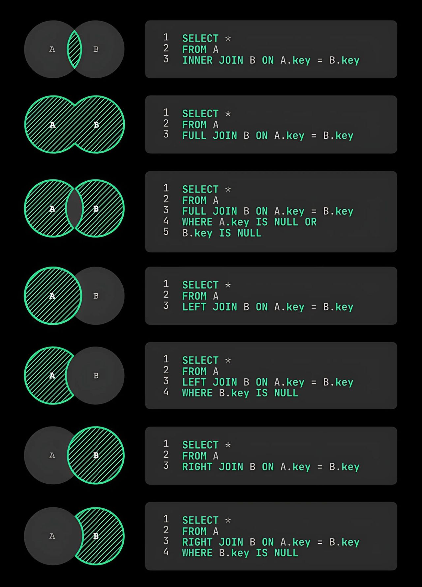

# Experiencia de Aprendizaje 2: Aplicando PHP para realizar interacciones con la base de datos.
## Semana 4: Realizando consultas SQL para trabajar con BBDD

## ¿Qué es SQL?

**SQL** (Structured Query Language) es el lenguaje que usamos para **hablarle** a una base de datos. Es como darle órdenes a un archivador gigante: pedirle que busque algo, que guarde un dato nuevo, que lo cambie o que lo borre.

> 💡 **Analogía:** Imagina una base de datos como una hoja de cálculo de Excel con miles de filas. SQL es el lenguaje con el que le preguntas cosas como: *"dame todas las filas donde la edad sea mayor a 25"* o *"cambia el nombre de la fila 3"*.

[Descargar presentación](material-clase/presentacion.pdf)

---

## ¿Qué es CRUD?

Todo lo que hacemos con datos se resume en **4 operaciones** llamadas **CRUD**:

| Letra | Operación | En SQL       | ¿Qué hace?                    |
|-------|-----------|--------------|-------------------------------|
| **C** | Create    | `INSERT INTO` | Agrega datos nuevos           |
| **R** | Read      | `SELECT`      | Lee / consulta datos          |
| **U** | Update    | `UPDATE`      | Modifica datos existentes     |
| **D** | Delete    | `DELETE`      | Elimina datos                 |

> 🔗 **URL para practicar online (sin instalar nada):**
> https://www.programiz.com/sql/online-compiler/
>
> Las tablas que ya vienen cargadas son:
> - `Customers` — clientes
> - `Orders` — pedidos
> - `Shippings` — envíos

---

## Parte 1: READ — Consultando datos con SELECT

`SELECT` es la instrucción más usada en SQL. Sirve para **leer** información de una tabla.

### Estructura básica

```
SELECT  [qué columnas quiero ver]
FROM    [en qué tabla están]
WHERE   [condición / filtro]   ← opcional
ORDER BY [cómo ordenar]        ← opcional
```

### 1.1 Ver TODOS los registros de una tabla

El asterisco `*` significa **"todas las columnas"**.

```sql
SELECT * 
FROM Customers;
```

### 1.2 Filtrar con WHERE — buscar solo lo que necesito

`WHERE` funciona como un **filtro**: solo muestra las filas que cumplen la condición.

```sql
-- Solo clientes que se llamen 'John'
-- ⚠️ Los textos siempre van entre comillas simples: 'John'
SELECT * 
FROM Customers 
WHERE first_name = 'John';
```

```sql
-- Apellidos que empiezan con "R"
-- LIKE 'R%' significa: comienza con R + lo que sea después
SELECT * 
FROM Customers 
WHERE last_name LIKE 'R%';
```

### 1.3 Operadores de comparación

Sirven para comparar valores numéricos (o de fecha) en el `WHERE`:

```sql
SELECT * FROM Customers WHERE age > 21;   -- mayores de 21
SELECT * FROM Customers WHERE age < 28;   -- menores de 28
SELECT * FROM Customers WHERE age >= 28;  -- 28 o más
SELECT * FROM Customers WHERE age <= 28;  -- 28 o menos
SELECT * FROM Customers WHERE age != 28;  -- todos EXCEPTO los de 28
```

| Símbolo | Significado       |
|---------|-------------------|
| `=`     | Igual a           |
| `!=`    | Distinto de       |
| `>`     | Mayor que         |
| `<`     | Menor que         |
| `>=`    | Mayor o igual que |
| `<=`    | Menor o igual que |

### 1.4 Combinar condiciones con AND y OR

```sql
-- AND → ambas condiciones deben cumplirse
SELECT * FROM Customers 
WHERE age > 21 AND country = 'USA';

-- OR → basta con que se cumpla una de las dos
SELECT * FROM Customers 
WHERE country = 'USA' OR country = 'UK';
```

### 1.5 Ordenar resultados con ORDER BY

```sql
-- Orden ascendente: A → Z  (por defecto)
SELECT first_name 
FROM Customers 
ORDER BY first_name ASC;

-- Orden descendente: Z → A
SELECT first_name 
FROM Customers 
ORDER BY first_name DESC;
```

### 1.6 Combinar todo junto

```sql
-- Mostrar solo nombre y apellido
-- de clientes de USA
-- ordenados de Z a A por nombre
SELECT first_name, last_name
FROM Customers
WHERE country = 'USA'
ORDER BY first_name DESC;
```

---

## Parte 2: CREATE — Insertando datos con INSERT INTO

`INSERT INTO` agrega una **fila nueva** a una tabla.

### Estructura

```
INSERT INTO nombre_tabla (columna1, columna2, ...)
VALUES (valor1, valor2, ...);
```

> ⚠️ El orden de los valores debe coincidir exactamente con el orden de las columnas.

```sql
-- Insertar un nuevo cliente
INSERT INTO Customers (customer_id, first_name, last_name, age, country)
VALUES (6, 'Pedro', 'Rojas', 40, 'MX');

-- Verificar que se insertó correctamente
SELECT *
FROM Customers
WHERE customer_id = 6;
```

---

## Parte 3: UPDATE — Modificando datos

`UPDATE` cambia el valor de uno o varios campos de una fila **ya existente**.

### Estructura

```
UPDATE nombre_tabla
SET columna1 = nuevo_valor
WHERE condicion;
```

> 🚨 **MUY IMPORTANTE:** Si omites el `WHERE`, se actualizarán **TODOS** los registros de la tabla. ¡Siempre incluye el `WHERE`!

```sql
-- Cambiar el nombre del cliente con id = 6
UPDATE Customers
SET first_name = 'Juan'
WHERE customer_id = 6;

-- Verificar el cambio
SELECT *
FROM Customers
WHERE customer_id = 6;
```

---

## Parte 4: DELETE — Eliminando datos

`DELETE` borra filas de una tabla.

### Estructura

```
DELETE FROM nombre_tabla
WHERE condicion;
```

> 🚨 **MUY IMPORTANTE:** Si omites el `WHERE`, se borrarán **TODOS** los registros de la tabla. ¡No hay ctrl+z!

```sql
-- Eliminar el cliente con id = 6
DELETE FROM Customers
WHERE customer_id = 6;

-- Verificar que ya no existe
SELECT *
FROM Customers
WHERE customer_id = 6;
```

---

## Aplicando CRUD al CMS de deportes

Ahora aplicamos lo aprendido a nuestro propio proyecto: un CMS (gestor de contenidos).

### Crear la base de datos y sus tablas

```sql
-- Crear la base de datos
CREATE DATABASE cms_deportes;

-- Usar la base de datos recién creada
USE cms_deportes;

-- Tabla de usuarios (las personas que escriben artículos)
CREATE TABLE cms_usuarios (
    u_id       INT PRIMARY KEY AUTO_INCREMENT, -- ID único, se genera solo
    u_nombre   VARCHAR(20) NOT NULL,           -- nombre completo
    u_username VARCHAR(10) UNIQUE NOT NULL,    -- nombre de usuario, no puede repetirse
    u_password VARCHAR(32) NOT NULL            -- contraseña (guardada como hash)
);

-- Tabla de artículos
CREATE TABLE cms_articulos (
    a_id         INT PRIMARY KEY AUTO_INCREMENT,
    a_titulo     VARCHAR(100) NOT NULL,
    a_autor      INT NOT NULL,                 -- guarda el u_id del usuario autor
    a_fecha      DATETIME NOT NULL,
    a_resumen    VARCHAR(200) NOT NULL,
    a_texto      TEXT NOT NULL,
    -- Relación: a_autor apunta a cms_usuarios.u_id
    -- ON DELETE CASCADE = si borras el usuario, se borran sus artículos también
    FOREIGN KEY (a_autor) REFERENCES cms_usuarios(u_id) ON DELETE CASCADE
);
```

> 💡 **¿Qué es una FOREIGN KEY (clave foránea)?**
> Es un campo que **apunta a otro registro** de otra tabla. Aquí, `a_autor` guarda el número de ID del usuario que escribió el artículo. Así las tablas quedan relacionadas.

### Insertar datos de prueba (CREATE)

```sql
-- Insertar 3 usuarios
INSERT INTO cms_usuarios (u_nombre, u_username, u_password)
VALUES 
    ('Juan Pérez',     'jperez',   'hash1'),
    ('María González', 'mrojas',   'hash2'),
    ('Pedro Ramírez',  'pramirez', 'hash3');

-- Insertar 3 artículos
-- Nota: a_autor = 1 significa que el autor es el usuario con u_id = 1 (Juan Pérez)
INSERT INTO cms_articulos (a_titulo, a_autor, a_fecha, a_resumen, a_texto)
VALUES 
    ('Título del Artículo 1', 1, '2025-01-18', 'Resumen del Artículo 1', 'Contenido del Artículo 1'),
    ('Título del Artículo 2', 2, '2025-01-19', 'Resumen del Artículo 2', 'Contenido del Artículo 2'),
    ('Título del Artículo 3', 2, '2025-01-20', 'Resumen del Artículo 3', 'Contenido del Artículo 3');
```

### Modificar un artículo (UPDATE)

```sql
-- Cambiar título y resumen del artículo con a_id = 1
UPDATE cms_articulos
SET 
    a_titulo  = 'Nuevo Título del Artículo 1',
    a_resumen = 'Nuevo Resumen del Artículo 1'
WHERE 
    a_id = 1;
```

### Eliminar un artículo (DELETE)

```sql
-- Borrar el artículo con a_id = 3
DELETE FROM cms_articulos
WHERE a_id = 3;
```

---

## JOIN — Combinando información de dos tablas

Hasta ahora usamos una sola tabla. Pero a veces la información que necesitamos está **repartida en dos tablas**.

> 💡 **Analogía:** Tienes una lista de artículos con un número de autor, y otra lista de usuarios con sus nombres. Para mostrar "el artículo X fue escrito por María", necesitas **unir** ambas listas. Eso hace el `JOIN`.

### Tipos de JOIN más comunes



| Tipo         | ¿Qué devuelve?                                                              |
|--------------|-----------------------------------------------------------------------------|
| `INNER JOIN` | Solo las filas que tienen coincidencia en **ambas** tablas                  |
| `LEFT JOIN`  | Todas las filas de la tabla izquierda, aunque no tengan coincidencia        |
| `RIGHT JOIN` | Todas las filas de la tabla derecha, aunque no tengan coincidencia          |

### Ejemplo: mostrar título del artículo + nombre del autor

```sql
-- Queremos ver: título del artículo, nombre del autor y fecha
-- Los títulos están en cms_articulos
-- Los nombres están en cms_usuarios
-- Se unen por: cms_articulos.a_autor = cms_usuarios.u_id

SELECT 
    cms_articulos.a_titulo AS Titulo,   -- AS le da un nombre al resultado
    cms_usuarios.u_nombre  AS Autor,
    cms_articulos.a_fecha  AS Fecha
FROM 
    cms_articulos
INNER JOIN 
    cms_usuarios
ON 
    cms_articulos.a_autor = cms_usuarios.u_id;
```

**Resultado esperado:**

| Titulo                      | Autor           | Fecha               |
|-----------------------------|-----------------|---------------------|
| Nuevo Título del Artículo 1 | Juan Pérez      | 2025-01-18 00:00:00 |
| Título del Artículo 2       | María González  | 2025-01-19 00:00:00 |

---

## Resetear / limpiar las tablas (útil para pruebas)

```sql
USE cms_deportes;

-- Borra todos los usuarios (y por CASCADE, también sus artículos)
DELETE FROM cms_usuarios;

-- Reinicia el contador de AUTO_INCREMENT a 1
-- Para que el próximo INSERT empiece desde id = 1
ALTER TABLE cms_usuarios  AUTO_INCREMENT = 1;
ALTER TABLE cms_articulos AUTO_INCREMENT = 1;
```

---

## Estructura completa de la base de datos del CMS

El CMS tendrá 5 tablas relacionadas entre sí:

```sql
-- TABLA: artículos del sitio
cms_articulos
    a_id           -- ID único del artículo (clave primaria)
    a_titulo       -- Título del artículo
    a_autor        -- ID del usuario que lo escribió (clave foránea → cms_usuarios)
    a_fecha        -- Fecha de publicación
    a_resumen      -- Texto corto de presentación
    a_texto        -- Contenido completo del artículo
    a_imagen       -- Nombre del archivo de imagen
    a_categoria_id -- ID de la categoría (clave foránea → cms_categorias)

-- TABLA: personas que administran el CMS
cms_usuarios
    u_id       -- ID único del usuario
    u_nombre   -- Nombre completo
    u_username -- Nombre de usuario para iniciar sesión
    u_password -- Contraseña (se guarda encriptada)

-- TABLA: categorías de los artículos (ej: Fútbol, Tenis, etc.)
cms_categorias
    c_id     -- ID único de la categoría
    c_nombre -- Nombre visible (ej: "Fútbol")
    c_slug   -- Versión para la URL (ej: "futbol", sin tildes ni espacios)

-- TABLA: etiquetas (palabras clave de los artículos)
cms_etiquetas
    e_id     -- ID único de la etiqueta
    e_nombre -- Nombre visible (ej: "Champions League")
    e_slug   -- Versión para la URL (ej: "champions-league")

-- TABLA INTERMEDIA: relaciona artículos con etiquetas
-- (Un artículo puede tener muchas etiquetas, y una etiqueta puede estar en muchos artículos)
cms_articulos_etiquetas
    ae_articulo_id -- ID del artículo
    ae_etiqueta_id -- ID de la etiqueta
```

### Relaciones entre tablas

```
cms_usuarios     ──┐
                   ├──< cms_articulos >──── cms_categorias
cms_etiquetas  ──<─┘    (via cms_articulos_etiquetas)
```

- **1 usuario** puede escribir **N artículos**
- **1 categoría** puede agrupar **N artículos**
- **1 artículo** puede tener **N etiquetas**
- **1 etiqueta** puede estar en **N artículos**

---

## Resumen de comandos SQL de la semana

| Operación | Comando SQL                                      | ¿Para qué?                   |
|-----------|--------------------------------------------------|------------------------------|
| Leer      | `SELECT * FROM tabla`                            | Ver todos los datos           |
| Filtrar   | `SELECT * FROM tabla WHERE condicion`            | Ver solo lo que necesito      |
| Ordenar   | `... ORDER BY columna ASC/DESC`                  | Ordenar el resultado          |
| Crear     | `INSERT INTO tabla (cols) VALUES (vals)`         | Agregar un registro nuevo     |
| Modificar | `UPDATE tabla SET col = val WHERE condicion`     | Cambiar un registro existente |
| Eliminar  | `DELETE FROM tabla WHERE condicion`              | Borrar un registro            |
| Combinar  | `SELECT ... FROM t1 INNER JOIN t2 ON t1.x = t2.y` | Unir datos de dos tablas    |
