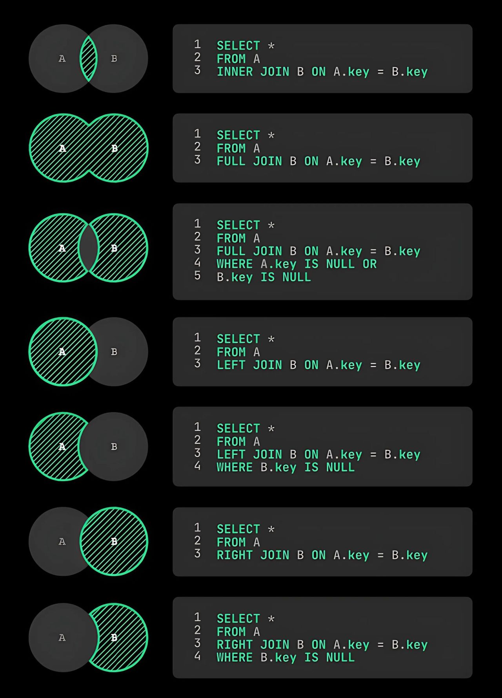

# Semana 4: Realizando consultas SQL para trabajar con BBDD
```sql
/*

CRUD
El acrónimo CRUD se refiere a las operaciones básicas utilizadas en la gestión de bases de datos y sistemas de información. Cada letra representa una de las cuatro operaciones principales:

Create (Crear)
Read (Leer)
Update (Actualizar)
Delete (Eliminar)

*/

-- Filtrando información
/*

URL Para practicar
https://www.programiz.com/sql/online-compiler/


Customer (Clientes)
Orders (Pedidos)
Shippings (Envíos)


*/

/* ==========================================================
   CRUD EN SQL (Programiz)
   ----------------------------------------------------------
   CRUD = Create (Crear), Read (Leer), Update (Actualizar), Delete (Eliminar)

   URL para practicar:
   https://www.programiz.com/sql/online-compiler/

   Tablas usadas:
   - Customers  (clientes)
   - Orders     (pedidos)
   - Shippings  (envíos)
   ========================================================== */


/* ==========================================================
   1) READ (LEER) — CONSULTAS BÁSICAS
   ========================================================== */

-- 1.1) Ver TODOS los clientes
SELECT * 
FROM Customers;

-- 1.2) Filtrar por nombre exacto (solo "John")
-- OJO: en SQL se usa comilla simple 'John' (más estándar que "John")
SELECT * 
FROM Customers 
WHERE first_name = 'John';

-- 1.3) Apellidos que empiezan con "R"
-- LIKE 'R%' significa: "R" + cualquier cosa después
SELECT * 
FROM Customers 
WHERE last_name LIKE 'R%';

-- 1.4) Edad mayor a 21
SELECT * 
FROM Customers 
WHERE age > 21;

-- 1.5) Edad menor a 28
SELECT * 
FROM Customers 
WHERE age < 28;

-- 1.6) Distinto de 28
SELECT * 
FROM Customers 
WHERE age != 28;

-- 1.7) Mayor o igual a 28
SELECT * 
FROM Customers 
WHERE age >= 28;

-- 1.8) Menor o igual a 28
SELECT * 
FROM Customers 
WHERE age <= 28;

-- 1.9) Ordenar nombres de forma ascendente (A → Z)
SELECT first_name 
FROM Customers 
ORDER BY first_name ASC;

-- 1.10) Ordenar nombres de forma descendente (Z → A)
SELECT first_name 
FROM Customers 
ORDER BY first_name DESC;

-- 1.11) Leer columnas específicas + filtro + orden
-- Solo mostramos first_name y last_name
-- Filtramos por country = 'USA'
-- Ordenamos por first_name de Z → A
SELECT first_name, last_name
FROM Customers
WHERE country = 'USA'
ORDER BY first_name DESC;


/* ==========================================================
   2) CREATE (CREAR) — INSERT
   ========================================================== */

-- Insertar un nuevo cliente
-- Si customer_id NO es autoincrement en Programiz, lo definimos manualmente.
-- Si es autoincrement, podrías omitir customer_id.
INSERT INTO Customers (customer_id, first_name, last_name, age, country)
VALUES (6, 'Pedro', 'Rojas', 40, 'MX');

-- Verificar que se insertó
SELECT *
FROM Customers
WHERE customer_id = 6;


/* ==========================================================
   3) UPDATE (ACTUALIZAR) — UPDATE
   ========================================================== */

-- Cambiar el nombre del cliente con id = 6
-- IMPORTANTE: SIEMPRE usa WHERE en UPDATE (para no actualizar toda la tabla).
UPDATE Customers
SET first_name = 'Juan'
WHERE customer_id = 6;

-- Verificar el cambio
SELECT *
FROM Customers
WHERE customer_id = 6;


/* ==========================================================
   4) DELETE (ELIMINAR) — DELETE
   ========================================================== */

-- Eliminar el cliente con id = 6
-- IMPORTANTE: SIEMPRE usa WHERE en DELETE (para no borrar toda la tabla).
DELETE FROM Customers
WHERE customer_id = 6;

-- Verificar que ya no existe
SELECT *
FROM Customers
WHERE customer_id = 6;

------------------------------------------------------------------

CREATE DATABASE cms_deportes;

-- Crear la tabla de usuarios
CREATE TABLE cms_usuarios (
    u_id INT PRIMARY KEY AUTO_INCREMENT,
    u_nombre VARCHAR(20) NOT NULL,
    u_username VARCHAR(10) UNIQUE NOT NULL,
    u_password VARCHAR(32) NOT NULL
);

-- Crear la tabla de artículos
CREATE TABLE cms_articulos (
    a_id INT PRIMARY KEY AUTO_INCREMENT,
    a_titulo VARCHAR(100) NOT NULL,
    a_autor INT NOT NULL,
    a_fecha DATETIME NOT NULL,
    a_resumen VARCHAR(200) NOT NULL,
    a_texto TEXT NOT NULL,
    FOREIGN KEY (a_autor) REFERENCES cms_usuarios(u_id) ON DELETE CASCADE
);


INSERT INTO cms_usuarios  (u_nombre, u_username, u_password)
VALUES 
    ('Juan Pérez', 'jperez', 'hash1'),
    ('María González', 'mrojas', 'hash2'),
    ('Pedro Ramírez', 'pramirez', 'hash3');

INSERT INTO cms_articulos (a_titulo, a_autor, a_fecha, a_resumen, a_texto)
VALUES 
    ('Título del Artículo 1', 1, '2025-01-18', 'Resumen del Artículo 1', 'Contenido del Artículo 1'),
    ('Título del Artículo 2', 2, '2025-01-19', 'Resumen del Artículo 2', 'Contenido del Artículo 2'),
    ('Título del Artículo 3', 2, '2025-01-20', 'Resumen del Artículo 3', 'Contenido del Artículo 3');


UPDATE cms_articulos
SET 
    a_titulo = 'Nuevo Título del Artículo 1',
    a_resumen = 'Nuevo Resumen del Artículo 1'
WHERE 
    a_id = 1;


DELETE FROM cms_articulos
WHERE a_id = 3;


-- JOIN
SELECT 
    cms_articulos.a_titulo AS Título,
    cms_usuarios.u_nombre AS Autor,
    cms_articulos.a_fecha AS Fecha
FROM 
    cms_articulos
INNER JOIN 
    cms_usuarios
ON 
    cms_articulos.a_autor = cms_usuarios.u_id;


--Limpiar tabla
USE cms_deportes;

-- Esto borrará los usuarios y, por cascade, también sus artículos
DELETE FROM cms_usuarios;

-- Si quieres reiniciar los autoincrement después de DELETE:
ALTER TABLE cms_usuarios AUTO_INCREMENT = 1;
ALTER TABLE cms_articulos AUTO_INCREMENT = 1;

```
# RESUMEN DE JOIN
